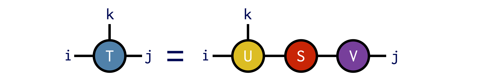
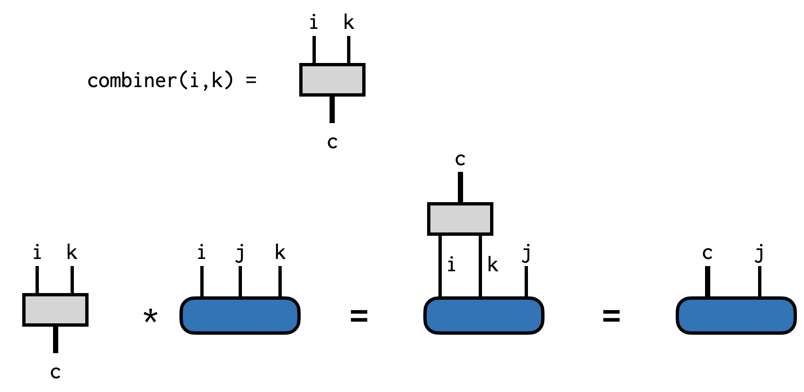

# [ITensor Code Examples](@id itensor_examples)


## Print Indices of an ITensor

Sometimes the printout of an ITensor can be rather large, whereas you
might only want to see its indices. For these cases, just wrap the
ITensor in the function `inds` like this:

```julia
@show inds(T)
```

or this

```julia
println("T inds = ",inds(T))
```

## Getting and Setting Elements of an ITensor

Say we have an ITensor constructed as:

```julia
i = Index(3,"index_i")
j = Index(2,"index_j")
k = Index(4,"index_k")

T = ITensor(i,j,k)
```

An ITensor constructed this way starts with all of its elements
equal to zero. (Technically it allocates no storage at all but this is
an implementation detail.)

**Setting Elements**

To set an element of this ITensor, such as the element where `(i,j,k) = (2,1,3)`,
you can do the following:

```julia
T[i=>2,j=>1,k=>3] = -3.2
```

In the Julia language, the notation `a=>b` is a built-in notation for making a `Pair(a,b)`
object.

Because the Index objects are passed to `T` along with their values, passing them in a different order has exactly the same effect:

```julia
# Both of these lines of code do the same thing:
T[j=>1,i=>2,k=>3] = -3.2
T[j=>1,k=>3,i=>2] = -3.2
```

**Getting Elements**

You can retrieve individual elements of an ITensor by accessing them through the same notation used to set elements:

```julia
el = T[j=>1,i=>2,k=>3]
println("The (i,j,k) = (2,1,3) element of T is ",el)
```

## Making ITensors from Arrays

To initialize all of the elements of an ITensor at once, you
can pass a Julia array into the ITensor constructor.

For example, if we want to construct an ITensor `A` with indices 
`i,j` we can initialize it from a matrix as follows:

```julia
M = [1.0 2.0;
     3.0 4.0]

i = Index(2,"i")
j = Index(2,"j")

A = ITensor(M,i,j)
```

More generally we can use an nth-order (n-dimensional) Julia array to initialize an ITensor:

```julia
T = randn(4,7,2)

k = Index(4,"index_k")
l = Index(7,"index_l")
m = Index(2,"index_m")

B = ITensor(T,k,l,m)
```

## Making Arrays from ITensors

Not only can we make an ITensor from a Julia array, but we can also convert
an ITensor back into a Julia array.

Say we have made an ITensor with two indices:

```@example from_array
using ITensors # hide
k = Index(4,"index_k")
m = Index(2,"index_m")

T = randomITensor(k,m)
@show T
display(T) # hide
```

Here we used the `randomITensor` constructor to fill T with random elements
but we could make an ITensor some other way too.

Now to convert `T` into a regular Julia array `A`, use the [`Array`](@ref) constructor
and pass the indices of `T` in the order that you want:

```@example from_array
A = Array(T,k,m)
@show A
```

The reason you have to pass the indices is that the ordering of ITensor indices
is an implementation detail and not part of the user interface. So when leaving the
ITensor system and converting to a regular array, you must say what ordering of the
indices you want. Making the array as `A = Array(T,m,k)` would give the transpose
of the array in the code above.

Note that for efficiency reasons, the array returned by the `array` function will
sometimes be a *view* of the ITensor, such that changing an element of `A` would
also change the corresponding element of `T`. This is not always the case though:
for example if the indices are passed in a different order from how the internal
ITensor storage is arranged, or if  `T` is a block-sparse ITensor, since the 
(not stored) zero blocks will need to be filled in.


## Arithmetic With ITensors

ITensors can be added and subtracted and multiplied by scalars just like plain tensors can. But ITensors have the additional feature that you can add and subtract them even if their indices are in a different order from each other, as long as they have the same collection of indices.

For example, say we have ITensors `A`, `B`, and `C`:
```julia
i = Index(3,"i")
j = Index(2,"j")
k = Index(4,"k")

A = randomITensor(i,j,k)
B = randomITensor(i,j,k)
C = randomITensor(k,i,j)
```
Above we have initialized these ITensors to have random elements, just for the sake of this example.

We can then add or subtract these ITensors

```julia
R1 = A + B
R2 = A - B
R3 = A + B - C
```

or do more complicated operations involving real and complex scalars too:

```julia
R4 = 2.0*A - B + C/(1+1im)
```

## Elementwise Operations on ITensors

[*Note: currently elementwise operations are only defined for dense ITensors, not for block-sparse QN ITensors.*]

ITensors support Julia broadcasting operations, making it quite easy to carry out element-wise operations on them in a very similar way as for regular Julia arrays. As a concrete example, consider the following ITensor initialized with random elements

```julia
i = Index(2,"i")
j = Index(3,"j")

A = randomITensor(i,j)
```

Here are some examples of basic element-wise operations we can do using Julia's dotted operator broadcasting syntax.

```julia
# Multiply every element of `A` by 2.0:
A .*= 2.0
```

```julia
# Add 1.5 to every element of A
A .+= 1.5
```

The dotted notation works for functions too:

```julia
# Replace every element in A by its absolute value:
A .= abs.(A)
```

```julia
# Replace every element in A by the number 1.0
A .= one.(A)
```

If have another ITensor `B = ITensor(j,i)`, which has the same set of indices
though possibly in a different order, then we can also do element-wise operations
involving both ITensors:

```julia
# Add elements of A and B element-wise
A .= A .+ B
# Add elements of A and B element-wise with coefficients included
A .= (2.0 .* A) .+ (-3.0 .* B)
```

Last but not least, it is possible to make custom functions yourself and broadcast them across elements of ITensors:

```julia
myf(x) = 1.0/(1.0+exp(-x))
T .= myf.(T)
```

## Making an ITensor with a Single Non-Zero Element

It is often useful to make ITensors with all elements zero
except for a specific element that is equal to 1.0. 
Use cases can include making product-state quantum wavefunctions
or contracting single-element ITensors with other ITensors to
set their indices to a fixed value.

To make such an ITensor, use the [`onehot`](@ref) function. Borrowing terminology from engineering,
a "one hot" vector or tensor has a single element equal to 1.0 and
the rest zero. (In previous versions of ITensor this function was called `setelt`.) 

The ITensor function [`onehot`](@ref) takes one or more 
Index-value Pairs such as `i=>2` and `j=>1` and returns an ITensor
with a 1.0 in the location specified by the Index values:

```@example onehot_1
using ITensors # hide
i = Index(2)
O1 = onehot(i=>1)
println(O1)
```
    
```@example onehot_2
using ITensors # hide
i = Index(2) # hide
O2 = onehot(i=>2)
println(O2)
```

```@example onehot_3
using ITensors # hide
i = Index(2) # hide
j = Index(3)
T = onehot(i=>2,j=>3)
println(T)
```

## Tracing an ITensor

An important operation involving a single tensor is tracing out certain
pairs of indices. Say we have an ITensor `A` with indices `i,j,l`:

```julia
i = Index(4,"i")
j = Index(3,"j")
l = Index(4,"l")

A = randomITensor(i,j,l)
```

and we want to trace `A` by summing over the indices `i` and `l` locked together,
in other words: ``\sum_{i} A^{iji}``.

To do this in ITensor, we can use a `delta` tensor, which you can think of as
an identity operator or more generally a Kronecker delta or "hyper-edge":


Viewed as an array, a delta tensor has all diagonal elements equal to 1.0 and
zero otherwise.

Now we can compute the trace by contracting `A` with the delta tensor:

```julia
trA = A * delta(i,l)
```


## Factoring ITensors (SVD, QR, etc.)

The ITensor approach to tensor factorizations emphasizes the structure
of the factorization, and does not require knowing the index ordering.

ITensor offers various tensor factorizations, such as the 
singular value decomposition (SVD) and the QR factorization. 
These are extended to the case of tensors by treating some of the indices
as the "row" indices and the rest of the indices as the "column" indices,
reshaping the tensor into a matrix to carry out the factorization, then
restoring the tensor structure at the end. All of these steps are done
for you by the ITensor system as we will see below.

#### Singular Value Decomposition

The singular value decomposition (SVD) is a matrix factorization
that is also extremely useful for general tensors.

As a brief review, the SVD is a factorization of a matrix M into the product
```math
M = U S V^\dagger
```
with U and V having the property ``U^\dagger U = 1`` and ``V^\dagger V = 1``.
The matrix S is diagonal and has real, non-negative entries known as the singular
values, which are typically ordered from largest to smallest. 
The SVD is well-defined for any matrix, including rectangular matrices. It also
leads to a controlled approximation, where the error due to discarding columns of U and V
is small if the corresponding singular values discarded are small.

To compute the SVD of an ITensor, you only need to specify which indices are (collectively) 
the "row" indices (thinking of the ITensor as a matrix), with the rest assumed to be the "column" 
indices.

Say we have an ITensor with indices i,j, and k

```julia
T = ITensor(i,j,k)
```

and we want to treat i and k as the "row" indices for the purpose of the SVD.

To perform this SVD, we can call the function `svd` as follows:

```julia
U,S,V = svd(T,(i,k))
```

Diagrammatically the SVD operation above looks like:



The guarantee of the `svd` function is that the ITensor 
product `U*S*V` gives us back an ITensor identical to T:

```julia
@show norm(U*S*V - T) # typical output: norm(U*S*V-T) = 1E-14
```

*Full working example:*

```julia
i = Index(3,"i")
j = Index(4,"j")
k = Index(5,"k")

T = randomITensor(i,j,k)

U,S,V = svd(T,(i,k))

@show norm(U*S*V-T)
```

**Truncated SVD**

An important use of the SVD is approximating a higher-rank tensor
by a product of lower-rank tensors whose indices range over only
a modest set of values.

To obtain an approximate SVD in ITensor, pass one or more of
the following accuracy parameters as named arguments:

* `cutoff` --- real number ``\epsilon``. Discard the smallest singular values
  ``\lambda\_n`` such that the <i>truncation error</i> is less than ``\epsilon``:
  $$
  \frac{\sum\_{n\in\text{discarded}} \lambda^2\_n}{\sum\_{n} \lambda^2\_n} < \epsilon \:.
  $$
  Using a cutoff allows the SVD algorithm to truncate as many states as possible while still
  ensuring a certain accuracy.

* `maxdim` --- integer M. If the number of singular values exceeds M, only the largest M will be retained.

* `mindim` --- integer m. At least m singular values will be retained, even if some fall below the cutoff

Let us revisit the example above, but also provide some of these accuracy parameters

```julia
i = Index(10,"i")
j = Index(40,"j")
k = Index(20,"k")
T = randomITensor(i,j,k)

U,S,V = svd(T,(i,k),cutoff=1E-2)
```

Note that we have also made the indices larger so that the truncation performed will be
non-trivial.
In the code above, we specified that a cutoff of ``\epsilon=10^{-2}`` be used. We can check that the resulting factorization is now approximate by computing the squared relative error:

```julia
truncerr = (norm(U*S*V - T)/norm(T))^2
@show truncerr
# typical output: truncerr = 8.24E-03
```

Note how the computed error is below the cutoff ``\epsilon`` we requested.

*Full working example including truncation:*

```julia
i = Index(10,"i");
j = Index(40,"j");
k = Index(20,"k");

T = randomITensor(i,j,k)

U,S,V = svd(T,(i,k),cutoff=1E-2)

@show norm(U*S*V-T)
@show (norm(U*S*V - T)/norm(T))^2
```

#### QR Factorization

Computing the QR factorization of an ITensor works in a similar way as for the SVD.
In addition to passing the ITensor you want to factorize, you must also pass
the indices you want to end up on the tensor `Q`, in other words to be treated
as the "row" indices for the purpose of defining the QR factorization.

Say we want to compute the QR factorization of an ITensor `T` with indices `i,j,k`,
putting the indices `i` and `k` onto `Q` and the remaining indices onto `R`. We
can do this as follows:


```julia
T = randomITensor(i,j,k)
Q,R = qr(T,(i,k);positive=true)
```

Note the use of the optional `positive=true` keyword argument, which ensures that
the diagonal elements of `R` are non-negative. With this option, the QR factorization
is *unique*, which can be useful in certain cases.

## Combining Multiple Indices into One Index

It can be very useful to combine or merge multiple indices of an ITensor into a 
single Index. Say we have an ITensor with indices `i,j,k` and we want to combine
Index `i` and Index `k` into a new Index. This new Index (call it `c`) will have
a dimension whose size is the dimension of `i` times the dimension of `k`.

To carry out this procedure we can make a special kind of ITensor: a combiner.
To make a combiner, call the function `combiner`, passing the indices you
want to combine:
```@example combiner
using ITensors # hide
i = Index(4,"i") # hide
j = Index(3,"j") # hide
k = Index(2,"k") # hide
C = combiner(i,k; tags="c")
nothing # hide
```

Then if we have an ITensor
```@example combiner
T = randomITensor(i,j,k)
@show inds(T)
```
we can combine indices `i` and `k` by contracting with the combiner:
```@example combiner
CT = C * T
nothing # hide
```

Printing out the indices of the new ITensor `CT` we can see that it 
has only two indices:
```@example combiner
@show inds(CT)
```
The first is the newly made combined Index, which was made for us by
the `combiner` function and the second is the `j` Index of `T`
which was not part of the combining process. To access the combined
Index you can call the `combinedind` function on the combiner:
```@example combiner
ci = combinedind(C)
```

We can visualize all of the steps above as follows:


Combining is not limited to two indices and you can
combine any number of indices, in any order, using a combiner.

To undo the combining process and uncombine the Index `c` back into `i,k`,
just contract with the conjugate of the combiner ITensor `dag(C)`. 
```@example combiner
UT = dag(C) * CT
@show inds(UT)
```


## Write and Read an ITensor to Disk with HDF5

Saving ITensors to disk can be very useful. For example, you
might encounter a bug in your own code, and by reading the
ITensors involved from disk you can shortcut the process of
running a lengthy algorithm over many times to reproduce the bug.
Or you can save the output of an expensive calculation, such as
a DMRG calculation, and use it as a starting point for multiple
follow-up calculations such as computing time-dependent properties.

ITensors can be written to files using the HDF5 format. HDF5 offers
many benefits such as being portable across different machine types,
and offers a standard interface across various libraries and languages.

**Writing an ITensor to an HDF5 File**

Let's say you have an ITensor `T` which you have made or obtained
from a calculation. To write it to an HDF5 file named "myfile.h5"
you can use the following pattern:

```julia
using ITensors.HDF5
f = h5open("myfile.h5","w")
write(f,"T",T)
close(f)
```

Above, the string "T" can actually be any string you want such as "ITensor T"
or "Result Tensor" and doesn't have to have the same name as the reference `T`.
Closing the file `f` is optional and you can also write other objects to the same
file before closing it.

[*Above we did `using ITensors.HDF5` since HDF5 is already included as a dependency with ITensor. You can also do `using HDF5` but must add the HDF5 package beforehand for that to work.*]

**Reading an ITensor from an HDF5 File**

Say you have an HDF5 file "myfile.h5" which contains an ITensor stored as a dataset with the
name "T". (Which would be the situation if you wrote it as in the example above.)
To read this ITensor back from the HDF5 file, use the following pattern:

```julia
using ITensors.HDF5
f = h5open("myfile.h5","r")
T = read(f,"T",ITensor)
close(f)
```

Note the `ITensor` argument to the read function, which tells Julia which read function
to call and how to interpret the data stored in the HDF5 dataset named "T". In the
future we might lift the requirement of providing the type and have it be detected
automatically from the data stored in the file.


