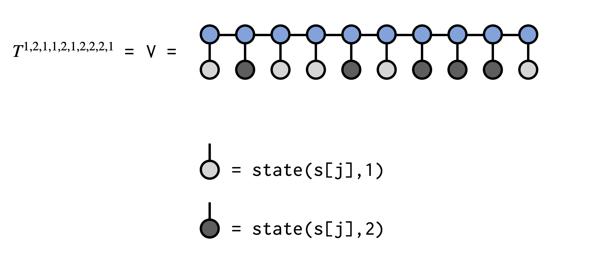
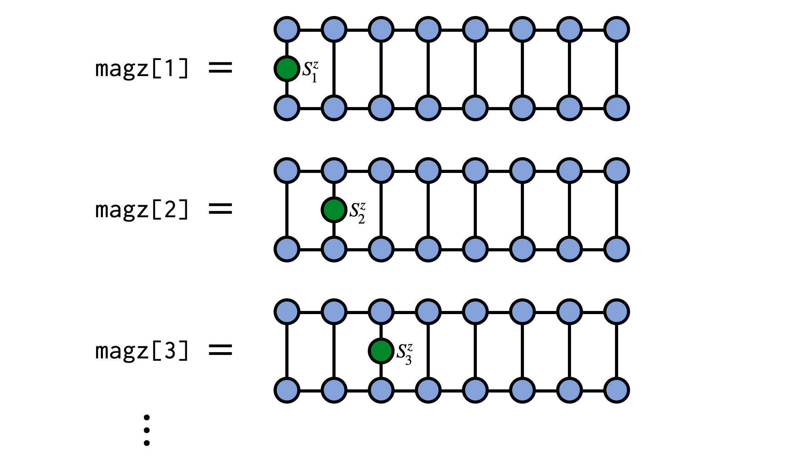
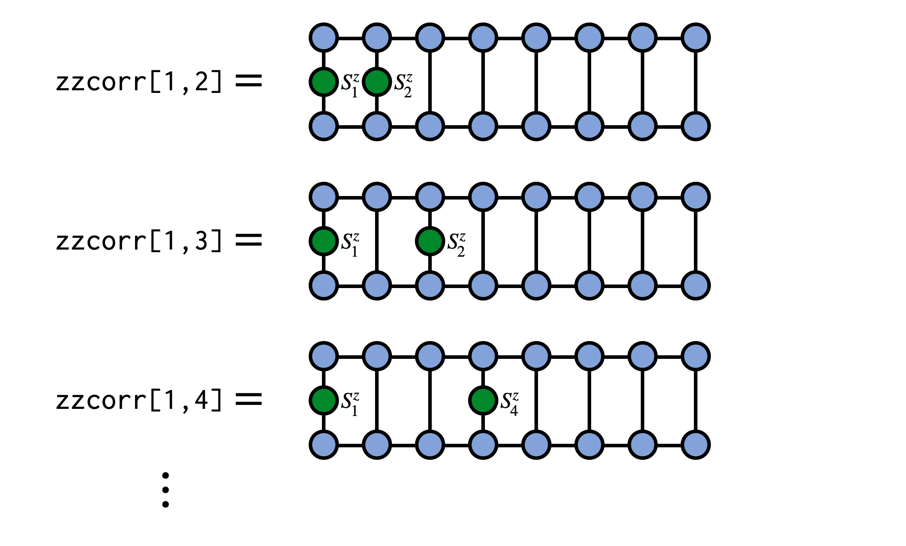

# MPS and MPO Examples

The following examples demonstrate operations available in ITensor
to work with [matrix product state (MPS)](http://tensornetwork.org/mps/)
(or tensor train) and matrix product operator (MPO) tensor networks.

## Creating an MPS from a Tensor


A matrix product state (MPS) made of N tensors, each with
one site or physical index, is a way of representing a single
tensor with N indices. One way of obtaining the MPS form of an
N-index tensor `T` is by repeatedly factorizing `T` into N 
separate tensors using a factorization such as the [Singular Value Decomposition](@ref) (SVD). 
This algorithm for obtaining an MPS is known in the mathematics
literature as the "tensor train SVD" or "TT-SVD" algorithm.

To turn an N-index (order-N) tensor T into an MPS, you can just
construct an MPS by passing T as the first argument, along with
keyword arguments that control the approximations used in factorizing
T. Let's look at a few specific cases.

#### ITensor to MPS Example

If you have a tensor `T` which is an ITensor and has indices `i,j,k,l,m`,
you can create an MPS approximation of `T` where the MPS has site indices
`i,j,k,l,m` as follows:

```julia
cutoff = 1E-8
maxdim = 10
T = randomITensor(i,j,k,l,m)
M = MPS(T,(i,j,k,l,m);cutoff=cutoff,maxdim=maxdim)
```

Here we used a random ITensor for illustrative purposes, but it could be any ITensor and
typically tensors with additional structure are more well approximated by MPS.

#### Julia Tensor to MPS Example

Another situation could be where you have a Julia array or Julia tensor of
dimension ``d^N`` and want to approximate it as an MPS with ``N`` site indices,
each of dimension ``d``. For example, we could have the following random Julia
array of dimension ``2\times 2\times 2 \times 2 \times 2``:

```julia
d = 2
N = 5
A = randn(d,d,d,d,d)
```

Alternatively, the array could be just a one dimensional array of length ``d^N``:

```julia
A = randn(d^N)
```

To convert this array to an MPS, we will first need a collection of Index objects
to use as the site indices of the MPS. We can conveniently construct an array of
four indices of dimension 2 as follows:

```julia
sites = siteinds(d,N)
```

Finally, we can pass our array `A` and our `sites` to the MPS constructor along with
parameters controlling the truncation level of the factorizations used:

```julia
cutoff = 1E-8
maxdim = 10
M = MPS(A,sites;cutoff=cutoff,maxdim=maxdim)
```

## Obtaining Elements of a Tensor Represented by an MPS

A matrix product state (MPS) or tensor train (TT) is a format for representing a large tensor having N indices in terms of N smaller tensors. Given an MPS represeting a tensor T
we can obtain a particular element ``T^{s_1 s_2 s_3 \cdots s_N}``
of that tensor using code similar to the following code below.

In the example code below we will obtain the element ``T^{1,2,1,1,2,1,2,2,2,1}`` of the tensor T
which is (implicitly) defined by the MPS psi:

```@example mps_element
using ITensors # hide
let # hide
N = 10
s = siteinds(2,N)
chi = 4
psi = randomMPS(s;linkdims=chi)

# Make an array of integers of the element we
# want to obtain
el = [1,2,1,1,2,1,2,2,2,1]

V = ITensor(1.)
for j=1:N
  V *= (psi[j]*state(s[j],el[j]))
end
v = scalar(V)

# v is the element we wanted to obtain:
@show v
end # hide
```

The call to `state(s[j],el[j])` in the code above makes a single-index ITensor
with the Index `s[j]` and the entry at location `el[j]` set to 1.0, with all other 
entries set to 0.0. Contracting this tensor with the MPS tensor at site `j` 
can be viewed as "clamping" or "fixing" the index to a set value. The resulting
tensors are contracted sequentially, overwriting the ITensor `V`, and the final
scalar value of `V` is the tensor element we seek.

See below for a visual depiction of what the above code is doing:



## Expected Value of Local Operators

When using an MPS to represent a quantum wavefunction ``|\psi\rangle``
a common operation is computing the expected value ``\langle\psi|\hat{A}_j|\psi\rangle``
of a local operator ``\hat{A}_j`` acting on site ``j``. This can be accomplished
efficiently and conveniently using the [`expect`](@ref) function as:

```julia
Avals = expect(psi,"A")
```

where `"A"` must be an operator associated with the physical site type, or site tags, of
the sites of the MPS `psi`. For example, the operator name could be 
`"Sz"` for spin sites or `"Ntot"` for electron sites.
(For more information about defining such operators yourself,
see the section on [Extending op Function Definitions](@ref custom_op).)

As a concrete example, consider computing the expectation value of ``S^z_j`` on
every site of an MPS representing a system of N spins of size ``S=1/2``. In the
following example we will use a random MPS of bond dimension ``\chi=4`` but the
MPS could be obtained other ways such as through a DMRG calculation.

```@example expect
using ITensors # hide
N = 10
chi = 4
sites = siteinds("S=1/2",N)
psi = randomMPS(sites,chi)
magz = expect(psi,"Sz")
for (j,mz) in enumerate(magz)
    println("$j $mz")
end
```



## Expected Values of MPO Operators

When using an MPS to represent a quantum wavefunction ``|\psi\rangle``
another common operation is computing the expected value ``\langle\psi|W|\psi\rangle``
of an operator ``W`` which is represented as a matrix product operator (MPO) tensor network.
A key example could be the Hamiltonian defining a quantum system.

Given an MPO `W` and an MPS `psi`, you can compute ``\langle\psi|W|\psi\rangle``
by using the function `inner` as follows:
```julia
ex_W = inner(psi',W,psi)
```
which will return a scalar that may be either real or complex, depending on the properties of
`psi` and `W`.

## Computing Correlation Functions

In addition to expected values of local operators
discussed above, another type of observable that is very important
in physics studies are correlation functions of the form

```math
C_{ij} = \langle\psi| A_i B_j |\psi\rangle
```

These can be computed efficiently for an MPS `psi` in ITensor
using the [`correlation_matrix`](@ref) function:

```julia
C = correlation_matrix(psi,"A","B")
```

where `"A"` and `"B"` must be an operator names associated with the physical site type, 
or site tags, of the sites of the MPS `psi`. For example, these strings could be 
`"Sz"`, `"S+"`, or `"S-"` for spin sites, or `"Cdagup"` and `"Cup"` for electron sites.
(For more information about defining such operators yourself,
see the section on [Extending op Function Definitions](@ref custom_op).)

As a concrete example, say we have an MPS `psi` for a system of spins and 
want to compute the correlator ``\langle\psi|S^z_i S^z_j|\psi\rangle``.
We can compute this as:

```julia
zzcorr = correlation_matrix(psi,"Sz","Sz")
```



See the [`correlation_matrix`](@ref) docs for more details about additional arguments you can pass
to this function.

## Applying a Single-site Operator to an MPS

In many applications one needs to modify a matrix product 
state (MPS) by multiplying it with an operator that acts 
only on a single site. This is actually a very straightforward
operation and this formula shows you how to do it in ITensor.

Say we have an operator ``G^{s'_3}_{s_3}`` which
which acts non-trivially on site 3 of our MPS `psi`
as in the following diagram:


To carry out this operation, contract the operator G with the MPS tensor for site 3,
removing the prime from the ``s'_3`` index afterward:


```julia
newA = G * psi[3]
noprime!(newA)
```

Finally, put the new tensor back into MPS `psi` to update its third MPS tensor:

```julia
psi[3] = newA
```

Afterward, we can visualize the modified MPS as:


As a technical note, if you are working in a context where gauge or orthogonality
properties of the MPS are important, such as in time evolution using two-site gates, 
then you may want to call `orthogonalize!(psi,3)`
before modifying the tensor at site 3, which will ensure that the MPS remains in a 
well-defined orthogonal gauge centered on site 3. Modifying a tensor which is left- or right-orthogonal
(i.e. not the "center" tensor of the gauge) will destroy the gauge condition and 
require extra operations to restore it. (Calling `orthogonalize!` method will automatically
fix this but will have to do extra work to do so.)


## Applying a Two-site Operator to an MPS

A very common operation with matrix product states (MPS) is 
multiplication by a two-site operator or "gate" which modifies 
the MPS. This procedure can be carried out in an efficient, 
controlled way which is adaptive in the MPS bond dimension.

Say we have an operator ``G^{s'_3 s'_4}_{s_3 s_4}`` which
is our gate and which acts on physical sites 3 and 4 of our MPS `psi`,
as in the following diagram:


To apply this gate in a controlled manner, first 'gauge' the MPS `psi` such
that either site 3 or 4 is the *orthogonality center*. Here we make site 3
the center:

```julia
orthogonalize!(psi,3)
```


The other MPS tensors are now either left-orthogonal or right-orthogonal and can be
left out of further steps without producing incorrect results.

Next, contract the gate tensor G with the MPS tensors for sites 3 and 4


```julia
wf = (psi[3] * psi[4]) * G
noprime!(wf)
```

Finally, use the singular value decomposition (SVD) to factorize the
resulting tensor, multiplying the singular values into either U or V.
Assign these two tensors back into the MPS to update it.


```julia
inds3 = uniqueinds(psi[3],psi[4])
U,S,V = svd(wf,inds3,cutoff=1E-8)
psi[3] = U
psi[4] = S*V
```

The call to `uniqueinds(psi[3])` analyzes the indices of `psi[3]` and `psi[4]` 
and finds any which are unique to just `psi[3]`, saving this collection of indices as `inds3`.
Passing this collection of indices to the `svd` function tells it to treat any indices 
that are unique to `psi[3]` as the indices which should go onto the `U` tensor afterward.
We also set a truncation error cutoff of 1E-8 in the call to `svd` to truncate 
the smallest singular values and control the size of the resulting MPS.
Other cutoff values can be used, depending on the desired accuracy,
as well as limits on the maximum bond dimension (`maxdim` keyword argument).

**Complete code example**

```julia
orthogonalize!(psi,3)

wf = (psi[3] * psi[4]) * G
noprime!(wf)

inds3 = uniqueinds(psi[3],psi[4])
U,S,V = svd(wf,inds3,cutoff=1E-8)
psi[3] = U
psi[4] = S*V
```

## Computing the Entanglement Entropy of an MPS

A key advantage of using the matrix product state (MPS) format to represent quantum wavefunctions is that it allows one to efficiently compute the entanglement entropy of any left-right bipartition of the system in one dimension, or for a two-dimensional system any "cut" along the MPS path.

Say that we have obtained an MPS `psi` of length N and we wish to compute the entanglement entropy of a bipartition of the system into a region "A" which consists of sites 1,2,...,b and a region B consisting of sites b+1,b+2,...,N.

Then the following code formula can be used to accomplish this task:

```julia
orthogonalize!(psi, b)
U,S,V = svd(psi[b], (linkind(psi, b-1), siteind(psi,b)))
SvN = 0.0
for n=1:dim(S, 1)
  p = S[n,n]^2
  SvN -= p * log(p)
end
```
    
As a brief explanation of the code above, the call to `orthogonalize!(psi,b)`
shifts the orthogonality center to site `b` of the MPS. 

The call to the `svd` routine says to treat the link (virtual or bond) Index connecting the b'th MPS tensor `psi[b]` and the b'th physical Index as "row" indices for the purposes of the SVD (these indices will end up on `U`, along with the Index connecting `U` to `S`).

The code in the `for` loop iterates over the diagonal elements of the `S` tensor (which are the singular values from the SVD), computes their squares to obtain the probabilities of observing the various states in the Schmidt basis (i.e. eigenvectors of the left-right bipartition reduced density matrices), and puts them into the von Neumann entanglement entropy formula ``S_\text{vN} = - \sum_{n} p_{n} \log{p_{n}}``.

## Sampling from an MPS

A matrix product state (MPS) can be viewed as defining a probability distribution 
through the Born rule, as is the case when the MPS represents a quantum wavefunction. 
To sample from the distribution defined by an MPS, you can use the function `sample`
provided in ITensor. For an MPS `psi` call to `sample(psi)` returns a random
sample from the distribution defined by `psi`. (Note that each sample is drawn anew
and not from a Markov chain seeded by a previous sample; this is possible because 
the algorithm for sampling MPS is a `perfect' sampling algorithm with no autocorrelation.)

In more detail, say we have a set of `N` site indices `s` and define a random MPS
with these sites:
```@example sample_mps; continued=true
using ITensors # hide
N = 10 # number of sites
d = 3  # dimension of each site
chi = 16 # bond dimension of the MPS
s = siteinds(d,N)
psi = randomMPS(s;linkdims=chi)
```

We can now draw some samples from this MPS as

```@example sample_mps
v1 = sample(psi)
v2 = sample(psi)
v3 = sample(psi)
println(v1)
println(v2)
println(v3)
```

The integers in each of the samples represent settings of each of the MPS indices
in the "computational basis".

For reasons of efficiency, the `sample` function requires the MPS to be in orthogonal
form, orthogonalized to the first site. If it is not already in this form, it
can be brought into orthogonal form by calling `orthogonalize!(psi,1)`.


## Write and Read an MPS or MPO to Disk with HDF5

**Writing an MPS to an HDF5 File**

Let's say you have an MPS `psi` which you have made or obtained
from a calculation. To write it to an HDF5 file named "myfile.h5"
you can use the following pattern:

```julia
using ITensors.HDF5
f = h5open("myfile.h5","w")
write(f,"psi",psi)
close(f)
```

Above, the string "psi" can actually be any string you want such as "MPS psi"
or "Result MPS" and doesn't have to have the same name as the reference `psi`.
Closing the file `f` is optional and you can also write other objects to the same
file before closing it.

[*Above we did `using ITensors.HDF5` since HDF5 is already included as a dependency with ITensor. You can also do `using HDF5` but must add the HDF5 package beforehand for that to work.*]

**Reading an MPS from an HDF5 File**

Say you have an HDF5 file "myfile.h5" which contains an MPS stored as a dataset with the
name "psi". (Which would be the situation if you wrote it as in the example above.)
To read this ITensor back from the HDF5 file, use the following pattern:

```julia
using ITensors.HDF5
f = h5open("myfile.h5","r")
psi = read(f,"psi",MPS)
close(f)
```

Many functions which involve MPS, such as the `dmrg` function or the `OpSum` system
require that you use an array of site indices which match the MPS. So when reading in
an MPS from disk, do not construct a new array of site indices. Instead, you can
obtain them like this: `sites = siteinds(psi)`.

So for example, to create an MPO from an OpSum which has the same site indices
as your MPS `psi`, do the following:

```julia
os = OpSum()
# Then put operators into os...

sites = siteinds(psi) # Get site indices from your MPS
H = MPO(os,sites)

# Compute <psi|H|psi>
energy_psi = inner(psi',H,psi)
```


Note the `MPS` argument to the read function, which tells Julia which read function
to call and how to interpret the data stored in the HDF5 dataset named "psi". In the 
future we might lift the requirement of providing the type and have it be detected
automatically from the data stored in the file.


**Writing and Reading MPOs**

To write or read MPOs to or from HDF5 files, just follow the examples above but use
the type `MPO` when reading an MPO from the file instead of the type `MPS`.

