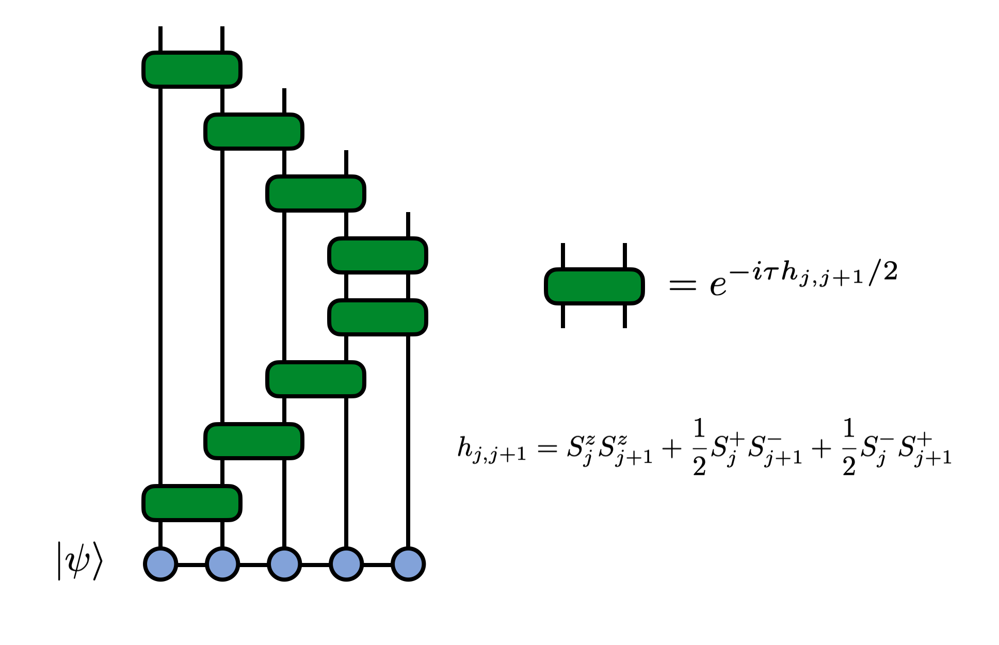

# MPS Time Evolution

An important application of [matrix product state (MPS)](https://tensornetwork.org/mps/) 
tensor networks in physics is computing the time evolution of a quantum state under the dynamics
of a Hamiltonian ``H``. An accurate, efficient, and simple way to time evolve a matrix product state (MPS) is by using a Trotter decomposition of the time evolution operator ``U(t) = e^{-i H t}``.

The technique we will use is "time evolving block decimation" (TEBD). 
More simply it is just the idea of decomposing the time-evolution operator into a circuit of
quantum 'gates' (two-site unitaries) using the Trotter-Suzuki approximation and applying these gates in
a controlled way to an MPS.

Let's see how to set up and run a TEBD calculation using ITensor.

The Hamiltonian ``H`` we will use is the one-dimensional Heisenberg model
which is given by:

```math
\begin{aligned}
H & = \sum_{j=1}^{N-1} \mathbf{S}_{j} \cdot \mathbf{S}_{j+1}  \\
& = \sum_{j=1}^{N-1} S^z_{j} S^z_{j+1} + \frac{1}{2} S^+_{j} S^-_{j+1} + \frac{1}{2} S^-_{j} S^+_{j+1}
\end{aligned} 
```

**The TEBD Method**

When the Hamiltonian, like the one above, is a sum of local terms,

```math
H = \sum_j h_{j,j+1}
```

where ``h_{j,j+1}`` acts on sites j and j+1,
then a Trotter decomposition that is particularly well suited for use
with MPS techniques is

```math
e^{-i \tau H} \approx e^{-i h_{1,2} \tau/2} e^{-i h_{2,3} \tau/2} \cdots e^{-i h_{N-1,N} \tau/2}
e^{-i h_{N-1,N} \tau/2} e^{-i h_{N-2,N-1} \tau/2} \cdots e^{-i h_{1,2} \tau/2} + O(\tau^3)
```

Note the factors of two in each exponential. Each factored exponential is known as a
Trotter "gate".

We can visualize the resulting circuit that will be applied to the MPS as follows:



The error in the above decomposition is of order ``\tau^3``, so that will be the error
accumulated _per time step_. Because of the time-step error, one takes ``\tau`` to be
small and then applies the above set of operators to an MPS as a single sweep, then
does a number ``(t/\tau)`` of sweeps to evolve for a total time ``t``. The total error
will therefore scale as ``\tau^2`` with this scheme, though other sources of error may
dominate for long times, or very small ``\tau``, such as truncation errors.

Let's take a look at the code to apply these Trotter gates to an MPS to
time evolve it. Then we will break down the steps of the code in more detail.


**ITensor TEBD Time Evolution Code**

Let's look at an entire, working ITensor code that will do this calculation then
discuss the main steps. (If you need help running the code below, see the getting
started page on running ITensor codes.)

```julia
using ITensors

let
  N = 100
  cutoff = 1E-8
  tau = 0.1
  ttotal = 5.0

  # Compute the number of steps to do
  Nsteps = Int(ttotal/tau)

  # Make an array of 'site' indices
  s = siteinds("S=1/2",N;conserve_qns=true)

  # Make gates (1,2),(2,3),(3,4),...
  gates = ITensor[]
  for j=1:N-1
    s1 = s[j]
    s2 = s[j+1]
    hj =       op("Sz",s1) * op("Sz",s2) +
         1/2 * op("S+",s1) * op("S-",s2) +
         1/2 * op("S-",s1) * op("S+",s2)
    Gj = exp(-1.0im * tau/2 * hj)
    push!(gates,Gj)
  end
  # Include gates in reverse order too
  # (N,N-1),(N-1,N-2),...
  append!(gates,reverse(gates))

  # Initialize psi to be a product state (alternating up and down)
  psi = productMPS(s, n -> isodd(n) ? "Up" : "Dn")

  c = div(N,2) # center site

  # Compute and print initial <Sz> value on site c
  t = 0.0
  Sz = expect(psi,"Sz";site_range=c:c)
  println("$t $Sz")

  # Do the time evolution by applying the gates
  # for Nsteps steps and printing <Sz> on site c
  for step=1:Nsteps
    psi = apply(gates, psi; cutoff=cutoff)
    t += tau
    Sz = expect(psi,"Sz";site_range=c:c)
    println("$t $Sz")
  end

  return
end
```

**Steps of The Code**

After setting some parameters, like the system size N and time step ``\tau`` to use,
we compute the number of time evolution steps `Nsteps` that will be needed.

The line `s = siteinds("S=1/2",N;conserve_qns=true)` defines an array of 
spin 1/2 tensor indices (Index objects) which will be the site or physical
indices of the MPS.

Next we make an empty array `gates = ITensor[]` that will hold ITensors 
that will be our Trotter gates. Inside the `for n=1:N-1` loop that follows
the lines

```julia
hj =      op("Sz",s1) * op("Sz",s2) +
    1/2 * op("S+",s1) * op("S-",s2) +
    1/2 * op("S-",s1) * op("S+",s2)
```

call the `op` function which reads the "S=1/2" tag on our site indices
(sites j and j+1) and which then knows that we want the spin 1/
2 version of the "Sz", "S+", and "S-" operators. 
The `op` function returns these operators as ITensors and we 
tensor product and add them together to compute the operator ``h_{j,j+1}``
defined as

```math
h_{j,j+1} = S^z_j S^z_{j+1} + \frac{1}{2} S^+_j S^-_{j+1} + \frac{1}{2} S^-_j S^+_{j+1} 
```

which we call `hj` in the code.

To make the corresponding Trotter gate `Gj` we exponentiate `hj` times
a factor ``-i \tau/2`` and then append or push this onto the end of the
gate array `gates`.

```julia
Gj = exp(-1.0im * tau/2 * hj)
push!(gates,Gj)
```

Having made the gates for bonds (1,2),(2,3),(3,4), etc. we still need
to append the gates in reverse order to complete the correct Trotter
formula. Here we can conveniently do that by just calling the Julia
`append!` function and supply a reversed version of the array of
gates we have made so far. This can
be done in a single line of code `append!(gates,reverse(gates))`.

So that the code produces interesting output, we define a function
called `measure_Sz` that we will pass our MPS into and which will
return the expected value of ``S^z`` on a given site, which
we will take to be near the center of the MPS. The details of this 
function are outside the scope of this tutorial, but are explained in the
example code for measuring MPS.

The line of code `psi = productMPS(s, n -> isodd(n) ? "Up" : "Dn")`
initializes our MPS `psi` as a product state of alternating 
up and down spins. We call `measure_Sz` before starting the
time evolution.

Finally, to carry out the time evolution we loop over
the step number `for step=1:Nsteps` and during each
step call the function 

```julia
psi = apply(gates, psi; cutoff=cutoff)
```

which applies the array of ITensors called `gates` to our current
MPS `psi`, truncating the MPS at each step using the truncation
error threshold supplied as the variable `cutoff`. 

The `apply` function is smart enough to determine which site indices
each gate has, and then figure out where to apply it to our
MPS. It automatically handles truncating the MPS and can
even handle non-nearest-neighbor gates, though that 
feature is not used in this example.

